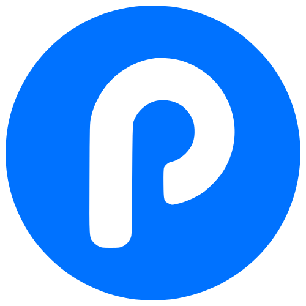

  

🧑‍💻  Pocket Coder — Portfolio Website
Un portfolio moderne, réactif et épuré conçu avec les technologies web standards (HTML5, CSS3, JavaScript Vanilla). Ce site vitrine met en avant mon expertise en tant qu'Ingénieur IA Appliquée & Développeur Full-Stack.
🌟 Fonctionnalités Principales
 * Design Glassmorphism & UI Moderne : Interface fluide utilisant des effets de flou, des dégradés subtils et une typographie équilibrée (Plus Jakarta Sans et JetBrains Mono).
 * Gestionnaire de Thème (Dark / Light) : Bascule automatique basée sur les préférences du système utilisateur ou bascule manuelle via un bouton dédié, avec persistance du choix (localStorage).
 * Menu Mobile Adaptatif : Navigation responsive optimisée pour smartphone et tablette avec overlay fluide.
 * Intégration WhatsApp Directe : Boutons d'action optimisés (CTA) pré-remplissant un message d'accroche pour la prise de contact rapide.
 * Sans Dépendance Lourde : Construit sans framework JS externe pour garantir un temps de chargement instantané et de très hautes performances.
📂 Structure du Projet
.
├── index.html        # Structure complète de la page web, styles CSS et scripts JS
├── logo.svg          # Logo SVG de Pocket Coder (favicon & navbar)
├── hero2.svg         # Illustration SVG de la section Hero
└── README.md         # Documentation du dépôt

🛠️ Stack Technique du Portfolio
| Élément | Technologie |
|---|---|
| Structure | HTML5 Sémantique |
| Styles | CSS3 (Variables CSS, Flexbox, Grid, Media Queries) |
| Interactivité | JavaScript Vanilla (ES6+) |
| Icônes | Font Awesome 6.5.1 |
| Typographies | Google Fonts (Plus Jakarta Sans, JetBrains Mono) |
💻 Visualiser le Projet en Local
Étant donné que le projet est constitué de fichiers statiques, vous n'avez pas besoin d'installer de dépendances complexes (Node.js/npm ne sont pas requis).
Option 1 : Directement dans le navigateur
Double-cliquez simplement sur le fichier index.html pour l'ouvrir dans n'importe quel navigateur.
Option 2 : Via un serveur local (Recommandé)
Pour éviter tout problème lié aux restrictions CORS sur les ressources locales ou les SVGs :
 * Avec VS Code : Installez l'extension Live Server, faites un clic droit sur index.html et sélectionnez Open with Live Server.
 * Avec Python : Exécutez la commande suivante dans le dossier du projet :
   python -m http.server 8000

   Accédez ensuite à http://localhost:8000 depuis votre navigateur.
📝 Personnalisation
Pour adapter ce portfolio à vos propres informations :
 * Informations Personnelles : Modifiez les balises <h1>, 
 et les descriptions dans le fichier index.html.
 * Coordonnées & Liens Sociaux : Recherchez et remplacez les liens :
   * WhatsApp : [https://wa.me/212644006421](https://wa.me/212644006421)
   * GitHub : [https://github.com/DragoneI](https://github.com/DragoneI)
   * Instagram : [https://www.instagram.com/pocket.coder](https://www.instagram.com/pocket.coder)
   * Email : dragonetechnology@gmail.com
 * Images & SVG : Remplacez logo.svg et hero2.svg par vos propres illustrations vectorielles ou images.
👤 À Propos de l'Auteur
Ismail Rayhan (Pocket Coder)
 * Rôle : Applied AI Engineer & Full-Stack Developer
 * Localisation : Agadir, Maroc
 * Spécialités : Systèmes RAG (Retrieval-Augmented Generation), Assistants LLM, Python / FastAPI, React, Supabase, Cloudflare Workers & Docker.
 * GitHub : @DragoneI
 * Instagram : @pocket.coder
📄 Licence
Ce projet est sous licence libre. Vous pouvez l'utiliser comme source d'inspiration ou comme template pour votre propre portfolio.
 
